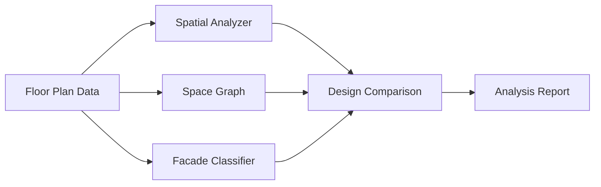

# Arch-Spatial-Intelligence 🏗️🧠

> **AI-powered architectural spatial analysis toolkit.**
> 
> Analyze, compare, and generate insights from architectural floor plans using computational spatial analysis.

---

## Overview

A Python toolkit for architectural spatial intelligence that combines **space syntax analysis**, **graph theory**, and **computer vision** to evaluate and compare design proposals.



---

## Features

| Module | Function | Output |
|---|---|---|
| `spatial_analyzer.py` | Space syntax analysis | Connectivity, integration, diversity metrics |
| `space_graph.py` | Topological graph generation | Adjacency graphs, circulation networks |
| `facade_classifier.py` | Architectural style classification | Style scores, feature analysis |
| `report_generator.py` | Automated report generation | Markdown reports |

### Spatial Metrics Computed
- **Connectivity** — How well spaces are linked
- **Integration** — How central each space is in the system
- **Circulation Ratio** — Efficiency of movement paths
- **Diversity Index** — Variety of space types
- **Openness** — Ratio of public to total space

---

## Quick Start

```bash
# Clone
git clone https://github.com/luisdingww-bit/Arch-Spatial-Intelligence.git
cd Arch-Spatial-Intelligence

# Run sample analysis
python examples/sample_analysis.py
```

### Example: Analyze a floor plan

```python
from src.spatial_analyzer import SpatialAnalyzer

analyzer = SpatialAnalyzer()

rooms = [
    {"name": "Lobby", "area": 80, "type": "public", "connections": [1, 2]},
    {"name": "Hall",  "area": 200, "type": "public", "connections": [0, 2]},
    {"name": "Corridor", "area": 50, "type": "circulation", "connections": [0, 1]},
]

metrics = analyzer.analyze_floor_plan(rooms)
print(metrics.summary())
```

---

## Example Output

Running `python examples/sample_analysis.py` compares two design proposals:

```
Scheme A - Central Courtyard:   overall 0.685
Scheme B - Linear Layout:       overall 0.623
```

A full report is generated at `docs/sample_report.md`.

---

## Applications

- 🏫 **Academic Research** — Space syntax analysis for thesis projects
- 🏗 **Design Studio** — Compare design alternatives quantitatively
- 🖨 **Portfolio** — Show data-driven design analysis
- 📊 **Graduate Application** — Demonstrate computational design skills

---

## Requirements

```
pip install -r requirements.txt
```

Core: `numpy`, `scipy`, `matplotlib`, `networkx`

---

## Repository Structure

```
Arch-Spatial-Intelligence/
├── src/                    # Core Python modules
│   ├── spatial_analyzer.py    # Space syntax analysis
│   ├── facade_classifier.py   # Facade classification
│   ├── space_graph.py         # Topological graphs
│   └── report_generator.py    # Report generation
├── examples/               # Usage examples
│   └── sample_analysis.py
├── data/                   # Sample data files
├── docs/                   # Documentation & reports
│   └── methodology.md
├── requirements.txt
└── README.md
```

---

## License

MIT License

Copyright (c) 2026 Louis Ding (丁俊晖)

Permission is hereby granted, free of charge, to any person obtaining a copy
of this software and associated documentation files (the "Software"), to deal
in the Software without restriction, including without limitation the rights
to use, copy, modify, merge, publish, distribute, sublicense, and/or sell
copies of the Software, and to permit persons to whom the Software is
furnished to do so, subject to the following conditions:

The above copyright notice and this permission notice shall be included in all
copies or substantial portions of the Software.

THE SOFTWARE IS PROVIDED "AS IS", WITHOUT WARRANTY OF ANY KIND, EXPRESS OR
IMPLIED, INCLUDING BUT NOT LIMITED TO THE WARRANTIES OF MERCHANTABILITY,
FITNESS FOR A PARTICULAR PURPOSE AND NONINFRINGEMENT. IN NO EVENT SHALL THE
AUTHORS OR COPYRIGHT HOLDERS BE LIABLE FOR ANY CLAIM, DAMAGES OR OTHER
LIABILITY, WHETHER IN AN ACTION OF CONTRACT, TORT OR OTHERWISE, ARISING FROM,
OUT OF OR IN CONNECTION WITH THE SOFTWARE OR THE USE OR OTHER DEALINGS IN THE
SOFTWARE.
