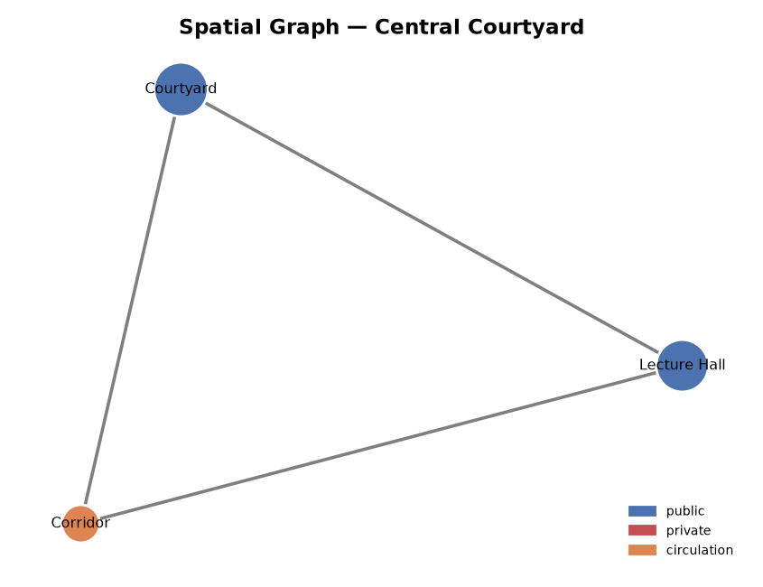
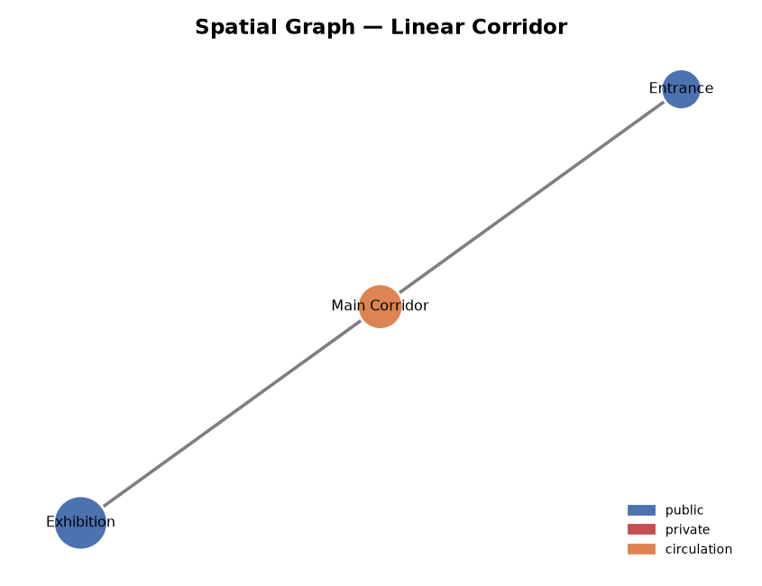
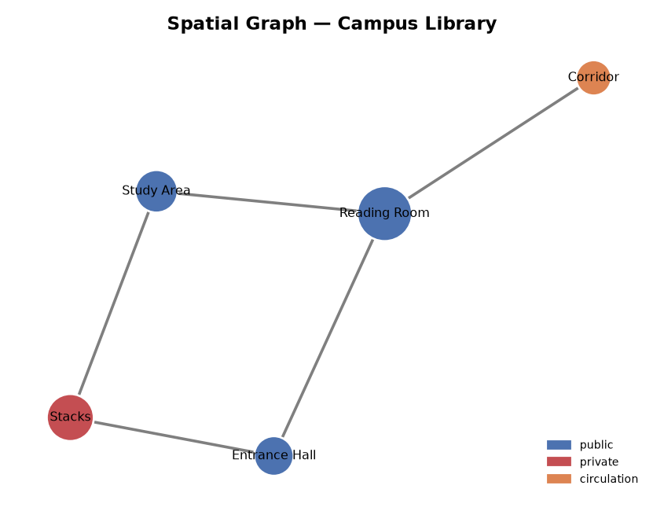
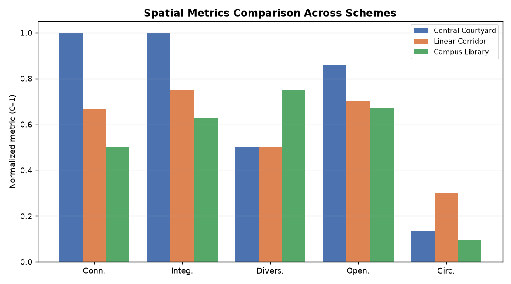

# Results

Generated by `examples/generate_results.py` from the real analyzer output.

## Spatial graphs
-  _Central Courtyard_
-  _Linear Corridor_
-  _Campus Library_

## Metrics comparison

## Ranking (overall spatial score)

| Scheme | Overall score |
|--------|---------------|
| Central Courtyard | 0.847 |
| Linear Corridor | 0.653 |
| Campus Library | 0.628 |

_All values are computed by `src/spatial_analyzer.py` — no fabricated data._
